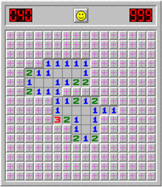

# This lecture shows an episode of test driven development

## Set up a project with Vitest:

1. `npm init -y`
2. `npm install --save-dev vitest husky prettier`
3. `npx husky init`
4. `npm pkg set scripts.test="prettier --check ."`
5. `npm pkg set scripts.test:watch="vitest --watch"``

Run the test `npm run test:watch`

## Leap year tests

Leap years are years with one extra day in February (why February?). A year is a leap year if it is
divisible by four, except if it is divisible by one hundred, except if it is divisible by four hundred.

[Read more on CodingDojo.org](https://codingdojo.org/kata/LeapYears/)

**Test progression:**

1. 2025 is not a leap year
2. 2028 is a leap year
3. 2032 is a leap year
4. 2100 is not a leap year
5. 2400 is a leap year

## Minesweeper

In the game MineSweeper, the player is supposed to uncover all the mines in a hidden grid. To help them
the game will show the number of mines in neighbour cells when the user opens a cell. In this programming
task, we take the input minefield and calculate the hints on the cells without mines

[Read more on CodingDojo.org](https://codingdojo.org/kata/Minesweeper/)

**Test progression:**

1. Return empty minefield
2. Should show correct number of rows
3. Should show correct number of columns
4. Display mines
5. Show hint to the right of mines
6. Show hint to the left of mines
7. Show hint to below mines
8. Show hint to above mines
9. Show hint to around mines
10. Show count mines around cell
